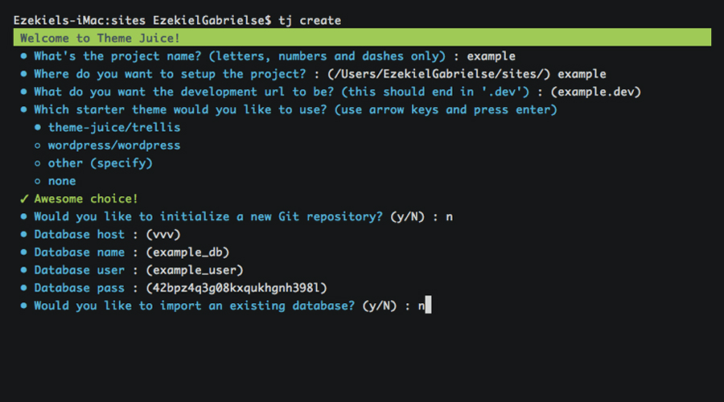
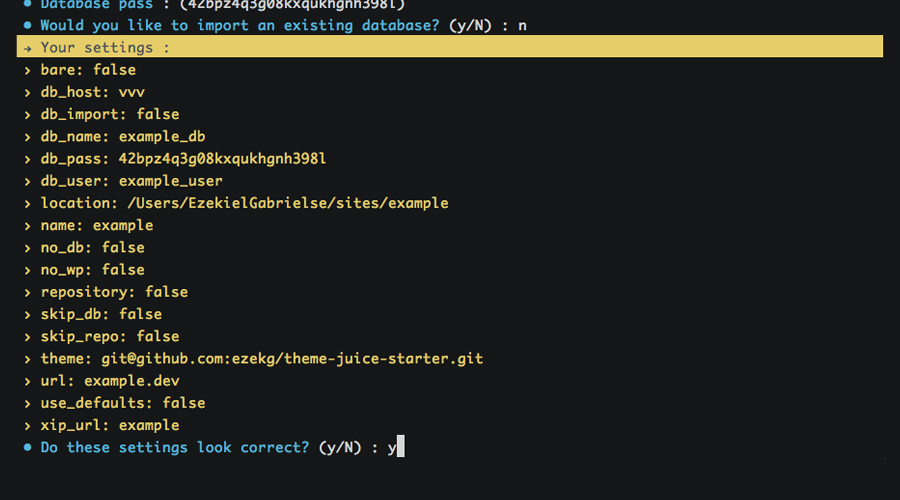
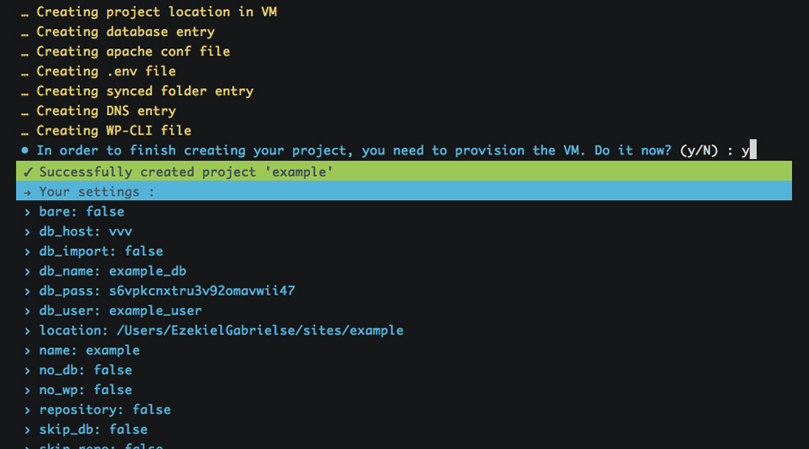

# Getting Started With Theme Juice For WordPress Development

Like most WordPress developers, I used MAMP for local development environments. MAMP works well for some people, but it doesn't really allow you to create reproducible development environments. Your environment is really at the will of both MAMP itself (i.e. your settings), as well as which operating system your developing on; and that's really not a good thing.

After awhile, the MAMP workflow isn't all that it's cracked up to be, especially once you begin needing to share environments between team members. Suffice it to say, we left the MAMP workflow behind once we were introduced to the ubiquitous [Vagrant](https://vagrantup.com/). I won't get into the details of that affair, [because there's already a great article written on that happening to somebody else](http://www.sitepoint.com/wordpress-meets-vagrant-vvv/). How do you ease yourself into Vagrant, when you're so used to your beloved MAMP workflow?

Enter, [Theme Juice](http://themejuice.it/) (or `tj`), a command line utility for modern WordPress development. It takes the pain out of local development by taking advantage of Vagrant and an Apache fork of [VVV](https://github.com/Varying-Vagrant-Vagrants/VVV/) called [VVV-Apache](https://github.com/ericmann/vvv-apache.git) as the virtual machine. It allows you to generate an unlimited number of local development projects, manage their dependencies, and even handles deploying them, _all from the command line_.

## Requirements
**This project requires [Vagrant](https://www.vagrantup.com/) and [VirtualBox](https://www.virtualbox.org/) to be able to create virtual machines for local development. Please download and install both of these before following along with this article.**

`tj` is written entirely in Ruby and requires at least version 1.9.3., but I recommend one of the latest versions of Ruby MRI (2.2, 2.1, 2.0). If you're curious if yours is supported, check out the [Travis CI](https://travis-ci.org/ezekg/theme-juice-cli) build, where I test against an array of different Ruby interpreters.

Lastly, it's recommend that you set up [SSH-keys for GitHub](https://help.github.com/articles/generating-ssh-keys/). Internally, `tj` uses `git clone` with SSH URLs, [so things might break if you don't have your keys set up properly](https://github.com/ezekg/theme-juice-cli#help-it-wont-let-me-git-clone-anything).

_If you're using Windows, rest assured that **you are supported**! Just be sure to check out the [documentation](https://github.com/ezekg/theme-juice-cli#is-windows-supported), because you might need to do a couple extra things to make sure it plays nicely with your operating system._

## Installation
It's as simple as running the command below inside of your terminal:

```
gem install theme-juice
```

_Depending on how your Ruby environment is set up, you may have to run that with `sudo`._

## Introduction
There has a been a great amount of work put into VVV by the community, but if there's one thing that isn't that great, it would be the process of creating a new project. After a few weeks of using VVV, I found myself doing the same steps over and over and over and over again:

1. Create a new project folder in the `www/` directory
2. Create a new conf file in `config/` for the `.dev` domain (which could be using Nginx or Apache, depending on your VVV flavor)
3. Create a new entry in `database/init-custom.sql` to set up a new database as well as a new user
4. Create a new entry in a `Customfile` to sync the local project folders to the VM folder (I don't like having my actual project within the VM, because then removing the site actually requires you to remove your project folders)
5. Create a new entry in a `Customfile` to automate adding your new domain to your `/etc/hosts` (in our case, setting up a local DNS server with [Landrush](https://github.com/phinze/landrush))
6. Create a new entry in a `Customfile` to allow me to access my local project from another device (i.e. my phone and tablet), using [xip.io](http://xip.io/)
7. Set up a local `wp-cli.local.yml` file to allow me to quickly execute [WP-CLI](http://wp-cli.org/) commands on the project (without actually having to SSH into the VM, change to the project directory, and then execute the commands from there)

I would literally do that multiple times a week. Talk about repetitive! The good news is that `tj` sits on top of VVV, automating all of that repetition; allowing you to quickly scaffold out (and manage) new development projects in just a few seconds.

## Features
 We'll get into the nitty gritty details in a bit, but first let me quickly lay out all of the features `tj` offers:

* New local development project generation (by executing the steps above)
* Management of existing projects, including project removal
* Build tool and dependency management (more on this later)
* Multi-stage single-command deployment, including database migration

But, isn't there already a few tools that do most of that work? At the time (i.e. mid last year), there was only [VVV Site Wizard](https://github.com/aliso/vvv-site-wizard), which didn't really satisfy all of the requirements put in place by the above steps; not to mention, we install WordPress inside of a subdirectory, which that script doesn't support in the way we needed.

One of the things about `tj` that differs itself from projects like VVV Site Wizard and Variable VVV is that `tj` sits on top of proven open source technologies, such as [Capistrano](http://capistranorb.com/) for deployment, and [Composer](https://getcomposer.org/) for [management of plugins and the actual WordPress installation](https://github.com/ezekg/theme-juice-starter/blob/master/composer.json). There's a huge eco-system around [WPackigist](http://wpackagist.org/), so we believe utilizing such great efforts is a no-brainer.

What that means is that `tj` doesn't provide you with options for selecting your WordPress version or which plugins you want to install, as all of that can (and should) be managed outside of `tj` via a starter theme. If you have an array of plugins that you prefer to use on every project, great! Just create a repository for your starter theme and voilà! You can use it within `tj` by either [requesting it to be added to the CLI itself](https://github.com/ezekg/theme-juice-cli#can-i-add-my-starter-theme-________), or just passing it in via the prompts (discussed below).

_One thing worth noting: when I talk about a "starter theme", I'm not referring to something like [Underscores](http://underscores.me/); rather, I'm talking about an entire WordPress-installation-starter, like [WP-Skeleton](https://github.com/markjaquith/WordPress-Skeleton), [Bedrock](https://github.com/roots/bedrock) or [our starter theme](https://github.com/ezekg/theme-juice-starter). So, if you're looking to use a custom starter theme, make sure it's a full WordPress installation, and not simply a theme. In a future version, this might be changed to something like 'kit'; it has remained this way so that we can 'just ship it!' i.e. get this project out into the hands of the community ASAP_

## Creating your first project

Now that we've discussed the steps that need automation, let's see how we take advantage of what `tj` has to offer. To get started, we simply have to run the following command: `tj create`. There's [a ton of flags available to this command](http://themejuice.it/create#GLOBAL-OPTIONS), but we won't get into them today.



This will lead us through a series of prompts to set up our project, including name and path for the project (remember, the path can be anywhere on your system!), the starter theme you would like to use, the database information, etc. Using all of that information, `tj` will create the necessary files needed to get you up and running as quickly as possible. At the end of all the series of prompts, you will be asked to confirm:



On your first `create`, it'll go ahead and install VVV into the `~/vagrant` directory (unless another path is specified via [global flags](http://themejuice.it/#GLOBAL-OPTIONS), or VVV is already installed) and then provision it, which might take a few minutes if you've never done it before.



After that's all finished up, `tj` will do its thing and in a few minutes (basically, the time it takes to provision the VM with the new changes), you'll have a brand new development project to work with. Did I mention that you can [automatically access this new project from any device on your network](https://github.com/ezekg/theme-juice-cli#can-i-access-a-project-from-another-device-ie-mobile)?

## Setting up an existing project
Working on an existing project? To make life easy, you can run `tj setup` to set up existing projects into the VM. The prompts will pretty much be identical to a `create` (interally, it's actually the same command), with a few prompts ommitted such as asking for a  starter theme. Like `create`, this command also has [a ton of flags available for it](http://themejuice.it/setup#GLOBAL-OPTIONS).

## Removing a project
One thing that I wanted to make sure was possible with `tj` is having the freedom to delete a project from the VM, without actually deleting all of my files. Why? Because I don't need 20 projects running inside of my VM, when I'm only actively working on 2-3 of them. This allows you to create, remove, and recreate projects with ease.

Now that I've mentioned how `tj` handles removals, to remove a project from the VM, simply run `tj delete` and follow the prompts. By default, your database is _not_ dropped when removing a project (to allow easier restoration later on), but just in case you want to drop it, you can use the `--drop-db` flag. [Check out the documenation to see the full list of flags.](http://themejuice.it/delete#GLOBAL-OPTIONS)

## Utilizing a `Juicefile`
The `Juicefile` is a YAML configuration file that can be used to store commonly-used build scripts and deployment configuration. Each command list can be mapped to an individual project's build tool, allowing a streamlined set of commands to be used across multiple projects that utilize different tools. To better understand this, check out [our starter theme's `Juicefile`](https://github.com/ezekg/theme-juice-starter/blob/master/Juicefile#L1-L37); it contains command mappings for all of our build tools and dependency managers:

```yml
commands:
  install:                         # Run application install scripts
    - composer install
    - bundle install
    - npm install
    - bower install
    - grunt build
  watch:                           # Manage build tools
    - grunt %args%
  assets:                          # Manage front-end dependencies
    - bower %args%
  vendor:                          # Manage back-end dependencies
    - composer %args%
  wp:                              # Manage WP installation
    - wp ssh --host=vagrant %args%
  backup:                          # Create a backup of the local database
    - mkdir -p backup
    - wp ssh --host=vagrant db export backup/$(date +'%Y-%m-%d-%H-%M-%S').local.sql
```

As you can tell by looking at the configuration above, we're able to do some minor scripting with arguments. This isn't huge, but does allow you to better utilize your aliases. For example, by running `tj install` we're able to quickly run our entire build process in the correct order; or another example, we can run `tj vendor update` to update all our our [Composer](https://getcomposer.org/) dependencies.

This feature obviously isn't for everybody, especially when you don't use many dependency managers or build tools. That being said, it works well for us, especially since our build stack is full of pre-compiled languages like Haml, Sass and CoffeeScript.

Interested in learning more about how to set up and utilize a `Juicefile`? Check out the [documentation](http://themejuice.it/) for all of the available options.

## Deploying a project
There's not a lot of things that I dislike more than FTP deployments. By utilizing the popular tool [Capistrano](https://github.com/capistrano/capistrano), plus an awesome [rsync extension](https://github.com/Bladrak/capistrano-rsync), `tj` is able to create one-command deployments for all of your projects that are both quick and reliable, without the need for having all of your build tools installed on your remote servers. Setting up a deployment stage is as simple as this:

```yml
stages:
  production:                      # Stage name
    server: 192.168.50.4           # Server IP or domain
    path: /var/www/production      # Path to the web root
    user: deploy                   # User to deploy as
    url: example.com               # URL for stage
    uploads: app/uploads           # Path to uploads directory from project root
    tmp: tmp                       # Path to temp directory
    shared:                        # Files to share between deployments
      - .env.production
    ignore:                        # Files to ignore on deployments
      - robots.txt
    roles:                         # Stage roles (for Capistrano)
      - :web
      - :app
      - :db
```

Once you set up your deployment configuration within your project's `Juicefile` ([check out our configuration for inspiration](https://github.com/ezekg/theme-juice-starter/blob/master/Juicefile#L39-L152)), you simply need to run `tj deploy <stage>`, and you're off! `tj` can also handle database migration with a single command via `tj remote <stage> db:pull` and  `tj remote <stage> db:push`.

In pretty much the same way, you can migrate the `uploads/` folder and `.env` file between stages. Want to get started with your first deploy? Head over [here](http://themejuice.it/deploy#SETUP) and follow the quick setup guide to easily get up and running.

## Conclusion
I hope you've enjoyed this article. We've looked into how `tj` can help you leave your dated MAMP workflow behind, while also allowing you to take advantage of its many features. Interested in learning more? Let us know! If the demand is there, I'd love to do a screencast for creating a new project, or setting up and deploying your first project.

If you have any questions regarding what we discussed today, let me know in the comments below or hit me up on [Twitter](https://twitter.com/ezekkkg) and I'll help you out wherever I can.
